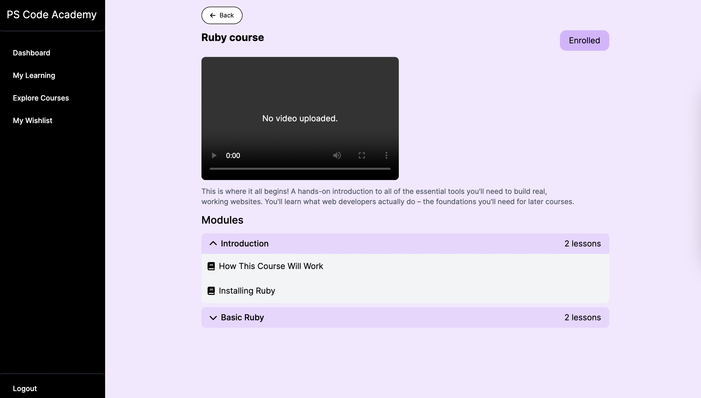

# PS Code Academy

**Admin Panel**

<div style="display: flex; justify-content: space-between;">
  
  
  
</div>

**Student Panel**

<div style="display: flex; justify-content: space-between;">
  
  
  
  
</div>

## Description
PS Code Academy is a web-based platform designed to help students and professionals learn web development fundamentals. The platform allows administrators to create and manage interactive courses, assignments, and rich content, while students can enroll, track progress, and submit assignments for review.

The project leverages modern Rails 7 features, StimulusJS and View Components, for a clean, modular architecture and a dynamic user experience.

## Key Features:

**Admin Panel:** Allows administrators to create and manage courses, modules, and assignments.

**Student Dashboard:** A user-friendly dashboard for students to track their progress and interact with course materials.

**Interactive Assignments:** Supports GitHub repository links and submission tracking with detailed statuses (e.g., pending review, completed, failed).

**Dynamic Components:** Includes reusable modal components and StimulusJS controllers for enhanced interactivity.

**Turbo-Driven UX:** Provides a modern, responsive interface powered by Turbo and Hotwire.

## Installation
Follow the steps below to set up PS Code Academy on your local machine.

**Requires:**
- Ruby 3.2
- Rails 7
- PostgreSQL
- Node.js
- Yarn
- Bundler

**Setup Instructions**

1. Clone the repository:

```
git clone https://github.com/PolinaStamenova/ps-code-academy.git
cd ps-code-academy
```

2. Install dependencies:

```
bundle install
yarn install
```

3. Set up the database:
```
rails db:create
rails db:migrate
rails db:seed
```

4. Run the development server:
```
bin/dev
```


## Usage:

**Admin Features**

**1. Create Courses:** Add new courses with a title, description, video, and image.

**2. Manage Modules:** Assign course modules to a course, allowing for modular content delivery.

**3. Interactive Assignments:** Create assignments with GitHub repository links and estimated time.

**Student Features**

**1. Enroll in Courses:** Students can enroll and access courses assigned to them.

**2. Submit Assignments:** Upload GitHub links for review.

**3. Track Progress:** View statuses like for review, passed, or failed.

## License

This project is licensed under the MIT License. See the LICENSE file for details.


